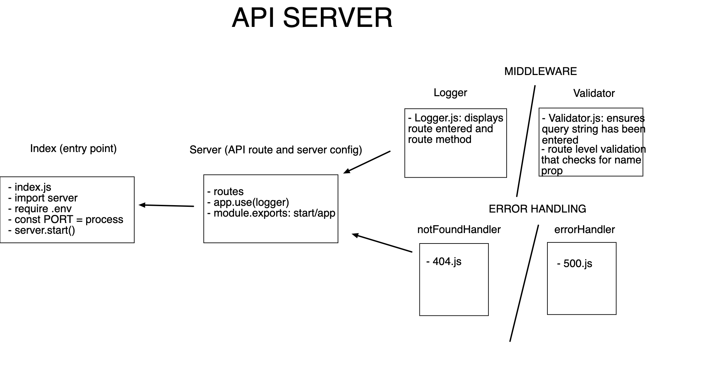

# LAB - Class 02

## Project: Express

### Author: Jenner Dulce

### Links and Resources

- [ci/cd](https://github.com/jennerdulce/basic-express-server/actions) (GitHub Actions)
- [Pull Request](https://github.com/jennerdulce/basic-express-server/pull/3)
- [HEROKU App](https://jennerdulce-basic-express-serv.herokuapp.com/)

### Setup

#### `.env` requirements (where applicable)

- `PORT` - 3000

#### How to initialize/run your application (where applicable)

- `nodemon`
- `node index.js`
- `npm start`

#### How to use your library (where applicable)

#### Tests

- 404 on a bad route
- 404 on a bad method
- 500 if no name in the query string
- 200 if the name is in the query string
- given an name in the query string, the output object is correct

#### UML

;
